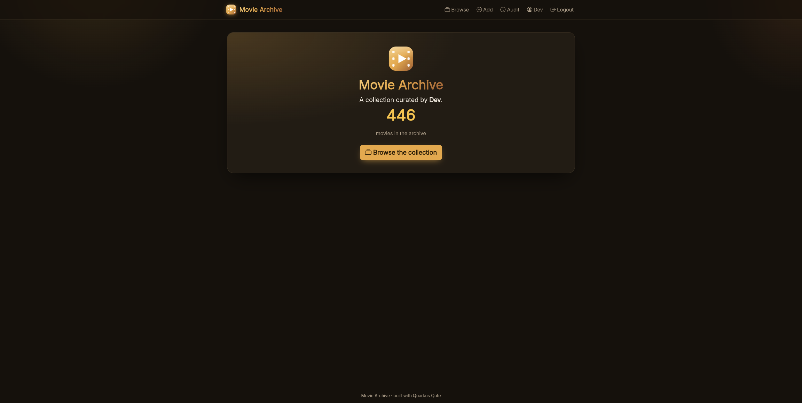
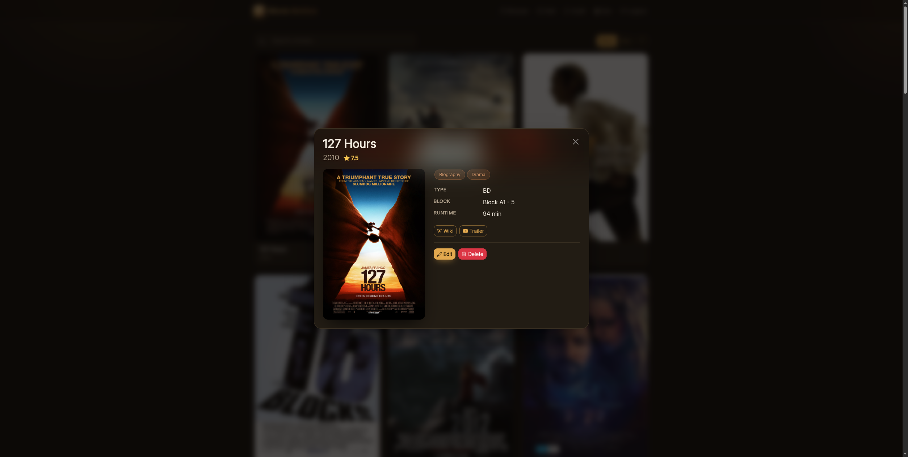
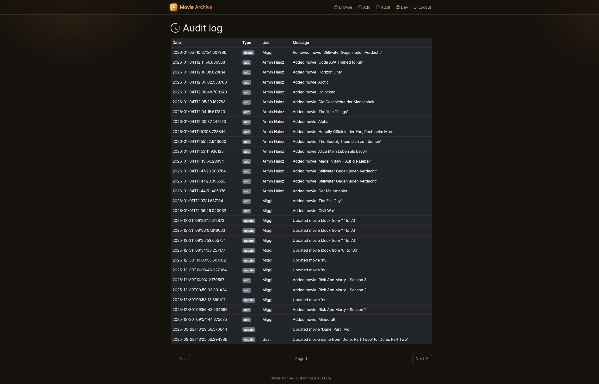

# Movie Archive

Movie Archive is a web app to manage a personal Blu-ray collection. It stores metadata only (no video files) and offers search, tagging, exports, and an audit log.



## Features
- Add, update, and search movies with metadata, ratings, and tags
- Tag-based browsing and detailed movie view
- Server-side UI at `/ui` (Qute templates + htmx, dark theme)
- CSV export of the collection
- Admin audit log for changes
- OIDC authentication (Keycloak-compatible)
- REST API with OpenAPI/Swagger

## Tech stack
- Quarkus 3 (Java 21), REST, Flyway, PostgreSQL
- Qute templates + htmx + Bootstrap for the UI
- OIDC (Keycloak)
- Docker (Quarkus Dockerfiles)

## Development setup

Requirements: Java 21 and Docker/Podman.

```
./mvnw quarkus:dev
```

Quarkus Dev Services will start PostgreSQL and load demo data via Flyway.

- UI: http://localhost:8080/ui
- API base URL: http://localhost:8080/api/v2/
- Swagger UI: http://localhost:8080/q/swagger-ui/
- OpenAPI: http://localhost:8080/api/v2/openapi

### Authentication (OIDC / Keycloak)

In development, the API is permissive (`%dev` profile), so you can run without
an IdP. To test authentication flows, run a Keycloak dev server and point
Quarkus to it:

```
docker run -p 8081:8080 -e KEYCLOAK_ADMIN=admin -e KEYCLOAK_ADMIN_PASSWORD=admin quay.io/keycloak/keycloak:22 start-dev
```

Then set OIDC config (for example via env vars) to your realm issuer URL and client:
`QUARKUS_OIDC_AUTH_SERVER_URL`, `QUARKUS_OIDC_CLIENT_ID`, `QUARKUS_OIDC_CREDENTIALS_SECRET`.
For production, the app reads `CLIENT_ID` and `CLIENT_SECRET`
(see `src/main/resources/application.properties`).

In production the IdP enforces PKCE and the app runs behind a TLS-terminating
reverse proxy. The `%prod` profile enables PKCE and proxy-forwarding headers
automatically — no extra configuration is needed beyond `CLIENT_ID`/`CLIENT_SECRET`.

## Containers (production)

```
./mvnw package -Dquarkus.container-image.push=false
docker build -f src/main/docker/Dockerfile.jvm -t movie-api .
```

## Screenshots

Browse:


Movie detail:


Audit log:

